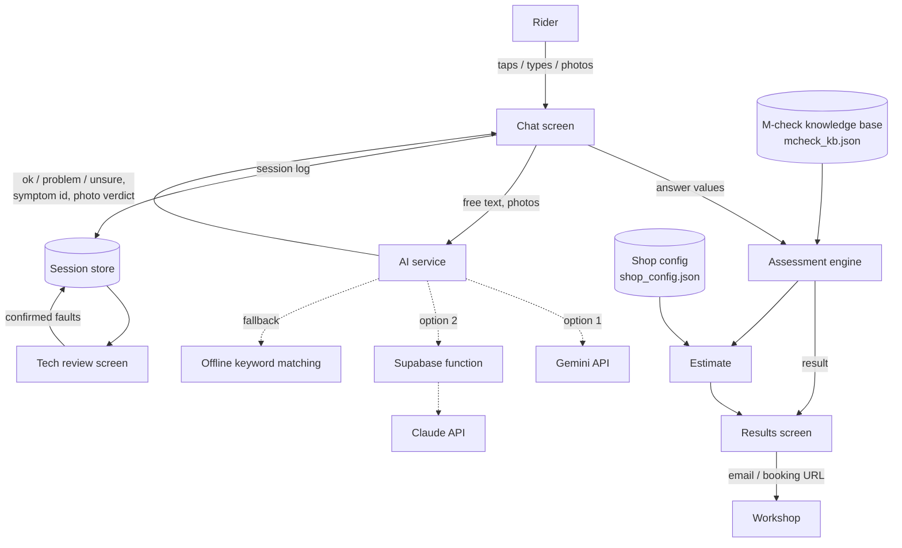

# Architecture

This document explains how Virtual Bike Assessor is put together and why.

## Design principles

1. **The engine decides, the AI translates.** A deterministic rule engine,
   driven by the M-check knowledge base, chooses every question and produces
   every result. The AI has three narrow jobs: map typed text to a symptom,
   map a typed answer to *ok / problem / unsure*, and judge a photo for one
   check. It never chooses the diagnosis.
2. **Safety is enforced in code, not in prompts.** Safety-critical checks are
   always asked, and "stop riding" warnings come from knowledge-base flags.
   Neither can be switched off by an AI response.
3. **Confidence, not verdicts.** A remote assessment can't see everything, so
   every finding carries a confidence level, and anything that needs hands-on
   inspection says so.
4. **Works without AI.** Offline mode supports every flow. The AI improves
   convenience but is not required.
5. **Shop-neutral.** Prices, labour times and booking details come from a
   per-shop configuration file, so the app isn't tied to any one retailer.
6. **Learn from confirmed outcomes.** Every session is logged. A technician
   records what was really wrong, and those records are what the diagnosis is
   tuned against.

## Component overview



## Components

| Component | File(s) | Responsibility |
|---|---|---|
| Knowledge base model | `app/lib/kb/knowledge_base.dart` | Reads `mcheck_kb.json` into typed Dart objects: sections, checks, repairs, symptoms, intake questions |
| Assessment engine | `app/lib/engine/assessment_engine.dart` | Runs intake, routes to a symptom or the full check, picks the next question, updates likelihoods, builds the result |
| Estimate | `app/lib/engine/estimate.dart` | Turns findings into prices using the shop config, merges combined jobs, suggests a service tier |
| AI services | `app/lib/ai/ai_service.dart`, `app/lib/ai/gemini_ai_service.dart` | One `AiService` interface with three implementations: offline, Gemini, and the backend (Claude) |
| App services | `app/lib/app_services.dart` | Loads the KB and shop config at startup, and picks the AI provider from build settings |
| Session store | `app/lib/data/session_store.dart` | Saves each assessment and tech review as JSON, and exports them all |
| Screens | `app/lib/ui/` | Home, chat, results and tech review |
| Backend function | `supabase/functions/assess/index.ts` | Optional server-side AI, so the key stays off the device |

The engine and knowledge-base code are **pure Dart with no Flutter imports**,
so they can run unchanged on a Dart server later. That's how the assessment
will be offered as an API to partner apps.

## A typical session

1. **Intake.** Make and model (free text, optional), eBike yes/no, brake type,
   suspension.
2. **Reason.** The rider picks a symptom or describes it. Free text goes to
   the AI (or keyword matching) to find the symptom id.
3. **Diagnosis loop.** The engine asks one question at a time. Each question
   is a customer-friendly version of an M-check item, with a quick self-test
   and optional photo guidance. The chat turns the reply into
   `ok / problem / unsure` and passes it to the engine.
4. **Result.** Findings (sorted with safety first), items the rider was unsure
   about, an eBike eligibility outcome, booking notes, and a price estimate.
5. **Logging.** The full session (answers, photos, AI photo verdicts, the
   likelihoods and the result) is saved for tech review.

## Data stored per session

```json
{
  "id": "1727222400000",
  "created_at": "2026-09-25T09:00:00.000",
  "assessment": {
    "kb_version": "0.2.0",
    "bike": { "make_model": "…", "is_ebike": false, "brake_type": "rim", "suspension": "none" },
    "symptom_id": "gears_slipping",
    "turns": [ { "prompt_id": "chain_wear", "question": "…", "value": "problem", "at": "…" } ],
    "posterior": { "chain_wear": 0.62, "gears_operate": 0.08 },
    "result": { "findings": [ { "cause_id": "chain_wear", "confidence": "low", "needs_hands_on_check": true } ] }
  },
  "tech_review": { "confirmed_causes": ["chain_wear"], "notes": "…", "reviewed_at": "…" }
}
```

Files are stored in the app's documents folder under `assessments/`. On the
web they're kept in memory only.

## Folder layout

```
app/
├── assets/
│   ├── kb/mcheck_kb.json          knowledge base
│   ├── config/shop_config.json    prices, labour rate, booking details
│   └── icon/app_icon.png          app icon source (1024×1024)
├── lib/
│   ├── main.dart                  app entry point and theme
│   ├── app_services.dart          startup wiring and AI provider choice
│   ├── kb/knowledge_base.dart     KB model and parser
│   ├── engine/
│   │   ├── assessment_engine.dart diagnosis logic
│   │   └── estimate.dart          pricing logic
│   ├── ai/
│   │   ├── ai_service.dart        interface, offline and backend providers
│   │   └── gemini_ai_service.dart Gemini provider
│   ├── data/session_store.dart    session logging and export
│   └── ui/
│       ├── home_screen.dart
│       ├── chat_screen.dart
│       ├── result_screen.dart
│       └── tech_review_screen.dart
├── test/
│   ├── engine_test.dart           KB integrity, flows, safety rules, pricing
│   └── gemini_ai_service_test.dart request format, parsing, fallback
├── secrets.example.json           template for API keys
└── pubspec.yaml
supabase/functions/assess/index.ts optional AI backend
```
