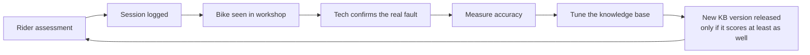

# Roadmap and learning loop

## Where the project is now (MVP)

- ✅ Guided assessment with intake, symptom routing and a full M-check
- ✅ Self-tests, photo guidance and optional AI photo judging
- ✅ Safety rules, confidence levels, "stop riding" warnings
- ✅ Price estimates from a shop price list, including combined jobs and service tier tips
- ✅ Booking request by email or booking page
- ✅ Session logging and a tech review screen
- ✅ Works offline, with Gemini, or with Claude through a backend

## The learning loop

The app improves from **outcomes confirmed by a technician**, never from its
own guesses. That keeps it grounded in what was actually wrong with real bikes.

### Stage 1: capture (now, up to about 100 sessions)

- Every session is saved with its answers, photos, AI verdicts and the app's
  conclusion.
- Technicians use **Tech review** to tick what was actually wrong and add notes.
- Next step: sync sessions to a shared database (Supabase free tier), so data
  from every phone and shop is pooled.
- Add a follow-up for people who fix it themselves ("Did that fix it?"). This
  counts as lower-quality evidence than a technician's confirmation.
- Ask for consent in the privacy notice before storing photos and using them
  for improvement (UK GDPR).

### Stage 2: measure (from the first reviewed sessions)

| Measure | Meaning | Target |
|---|---|---|
| Top-1 hit rate | The app's first finding matches the confirmed fault | Rising |
| Top-3 hit rate | The confirmed fault is in the app's top three | Rising |
| **Missed safety faults** | Confirmed safety-critical faults the app didn't flag | **Zero, and never allowed to rise** |
| Questions per assessment | How quickly the app gets there | Falling |

These are tracked per knowledge-base version (`meta.version`), so each change
can be compared with the last.

### Stage 3: tune the rules (a few hundred cases). No machine learning needed.

- **Starting probabilities:** replace the estimated `candidates` values with
  how often each cause was actually confirmed for that symptom. While data is
  thin, blend it with the expert estimate:
  `(confirmed count + k × estimate) ÷ (total + k)`.
- **Question weights:** for each question, measure how often *Something's
  wrong* really meant that fault. That replaces the fixed `problemFactor` and
  `okFactor`.
- **Missing branches:** faults technicians confirm that aren't in a symptom's
  candidates show where to add causes or questions.
- **Safe release:** a new KB version is only released if it scores at least
  as well on past cases it wasn't tuned on, with no increase in missed safety faults.

### Stage 4: train models (thousands of cases)

- **Photo checkers:** small image models for single checks (for example brake
  pads worn or OK, chain and cassette teeth worn or OK), trained on
  technician-labelled photos. They can run on the phone, which makes them fast,
  free to run and private.
- **Symptom routing:** a small text model trained on real rider descriptions,
  replacing keyword matching.

## Planned work

1. **Shared backend:** Supabase auth, an `assessments` table, photo storage,
   and a web dashboard for tech review.
2. **Insights screen:** hit rate and missed safety faults per KB version.
3. **Retuning script:** recalculate probabilities from reviewed sessions and
   produce the next KB version.
4. **Parts pricing:** configurable sources (retailer feeds, shop price lists). No scraping.
5. **Embedding:** offer the engine as an API (reusing the pure-Dart engine on
   a Dart server), plus a web widget other sites and apps can embed.
6. **Phase 2, DIY guides:** step-by-step help linked from findings marked
   *DIY possible*.
7. **Tech video review:** an optional paid upgrade where a technician reviews
   a short guided video. It also produces high-quality labelled data.
8. **Booking integration:** a direct booking API once a workshop partner agrees.
